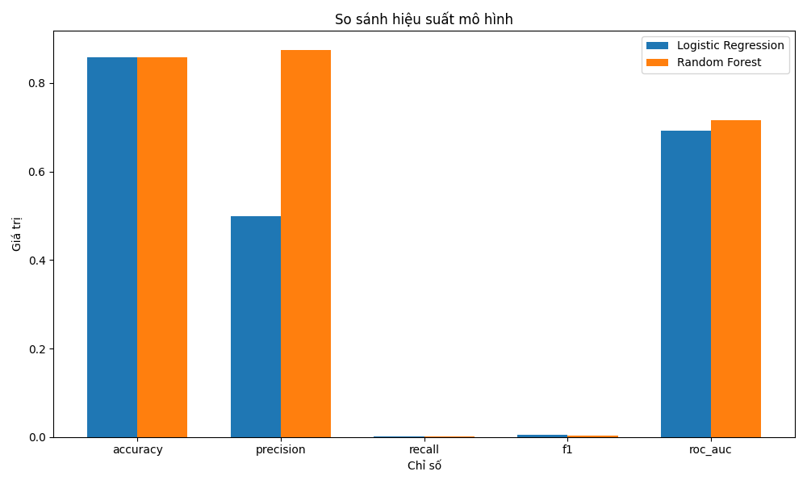

# Chương 5: Đánh giá hiệu suất mô hình và các yếu tố ảnh hưởng đến độ chính xác

## 5.1. Các chỉ số đánh giá hiệu suất

Kết quả đánh giá trên tập validation:

| Chỉ số    | Logistic Regression | Random Forest |
| --------- | ------------------- | ------------- |
| Accuracy  | 85.80%              | 85.82%        |
| Precision | 50.00%              | 87.50%        |
| Recall    | 0.21%               | 0.19%         |
| F1-score  | 0.42%               | 0.38%         |
| AUC-ROC   | 0.69                | 0.72          |

Các kết quả này cho thấy cả hai mô hình đều đạt độ chính xác (Accuracy) tương đương nhau, ở mức khoảng 85.8%. Tuy nhiên, có sự khác biệt đáng kể về các chỉ số khác:

-   **Precision**: Random Forest đạt 87.50%, cao hơn nhiều so với Logistic Regression (50.00%), cho thấy khi Random Forest dự đoán một từ vựng sẽ bị quên, dự đoán này thường chính xác hơn.

-   **Recall**: Cả hai mô hình đều có Recall rất thấp (khoảng 0.2%), chỉ ra rằng các mô hình chỉ phát hiện được một tỷ lệ rất nhỏ các trường hợp từ vựng thực sự bị quên.

-   **AUC-ROC**: Random Forest (0.72) có khả năng phân biệt tốt hơn một chút so với Logistic Regression (0.69).

_Hình 5.1: So sánh hiệu suất của mô hình Logistic Regression và Random Forest trên các chỉ số đánh giá_

## 5.2. Phân tích các yếu tố ảnh hưởng đến độ chính xác

Dựa trên phân tích tầm quan trọng của đặc trưng từ cả hai mô hình, tôi xác định được các yếu tố chính ảnh hưởng đến khả năng ghi nhớ từ vựng:

_Hình 5.2: Tầm quan trọng của các đặc trưng trong mô hình Logistic Regression và Random Forest_

### 5.2.1. Loại bài tập (format)

**Format_reverse_tap** là đặc trưng quan trọng nhất trong mô hình Logistic Regression (0.4478) và đứng thứ hai trong mô hình Random Forest (0.2054). Kết quả này cho thấy loại bài tập mà học viên thực hiện có ảnh hưởng lớn đến khả năng ghi nhớ từ vựng. Bài tập dạng "reverse_tap" (nhập từ trong ngôn ngữ đích khi được cho từ trong ngôn ngữ nguồn) dường như hiệu quả hơn các loại bài tập khác.

### 5.2.2. Số lần thử (num_attempts)

**Num_attempts** là đặc trưng quan trọng thứ hai trong mô hình Logistic Regression (0.3922) và quan trọng nhất trong mô hình Random Forest (0.2059). Điều này khẳng định tầm quan trọng của việc lặp lại trong quá trình học tập từ vựng. Tần suất tiếp xúc với một từ vựng có tương quan nghịch với biến mục tiêu (-0.09), cho thấy học viên thường nhớ tốt hơn các từ vựng mà họ đã thực hành nhiều lần.

### 5.2.3. Tỷ lệ trả lời đúng (correct_ratio)

**Correct_ratio** là đặc trưng quan trọng thứ tư trong Logistic Regression (0.2009) và thứ ba trong Random Forest (0.1626). Tỷ lệ trả lời đúng có tương quan thuận với khả năng ghi nhớ từ vựng (0.08), nghĩa là học viên thường nhớ tốt hơn các từ vựng mà họ đã trả lời đúng nhiều lần trước đó.

## 5.3. Cải thiện hiệu suất mô hình

Để cải thiện hiệu suất của mô hình, đặc biệt là độ nhạy (Recall), tôi đề xuất một số phương pháp:

1. **Cân bằng dữ liệu**:

    - Sử dụng kỹ thuật lấy mẫu như SMOTE (Synthetic Minority Over-sampling Technique)
    - Áp dụng kỹ thuật undersampling cho lớp âm tính
    - Sử dụng trọng số cho các lớp trong quá trình huấn luyện

2. **Thêm đặc trưng mới**:

    - Bổ sung các đặc trưng về đặc điểm ngôn ngữ học của từ vựng
    - Tạo đặc trưng tương tác giữa các đặc trưng hiện có
    - Thêm đặc trưng về sở thích và hành vi học tập của học viên

3. **Điều chỉnh ngưỡng quyết định**:
    - Thay vì sử dụng ngưỡng mặc định (0.5), điều chỉnh ngưỡng quyết định để tăng độ nhạy
    - Sử dụng phương pháp tối ưu hóa ngưỡng dựa trên F1-score

## 5.4. So sánh với tỷ lệ ghi nhớ thực tế của Duolingo

### 5.4.1. Mô hình ghi nhớ từ vựng của Duolingo

Duolingo đã phát triển một mô hình gọi là Half-Life Regression (HLR) để tối ưu hóa việc học và ghi nhớ từ vựng. Theo thông tin từ blog chính thức của Duolingo [^1], mô hình HLR này:

-   Dự đoán "nửa đời" (half-life) của từng từ vựng trong bộ nhớ dài hạn của người học
-   Kết hợp lý thuyết tâm lý ngôn ngữ về đường cong quên với kỹ thuật học máy hiện đại
-   Phân tích mẫu lỗi của hàng triệu người học để dự đoán tốt hơn

Về hiệu quả, mô hình HLR có tỷ lệ lỗi dự đoán thấp hơn gần 50% so với hệ thống Leitner mà Duolingo sử dụng trước đó. Tuy nhiên, Duolingo không công bố con số cụ thể về tỷ lệ ghi nhớ từ vựng mà chỉ đề cập đến sự cải thiện tỷ lệ người dùng quay lại: tăng 9.5% cho các buổi luyện tập, tăng 1.7% cho bài học, và tăng 12% cho hoạt động tổng thể.

### 5.4.2. So sánh với mô hình của nghiên cứu này

Mô hình của nghiên cứu này đạt độ chính xác (accuracy) khoảng 85.8% trong việc dự đoán khả năng ghi nhớ từ vựng. Tuy nhiên, cần lưu ý rằng có sự khác biệt về tiêu chí đánh giá (Duolingo tập trung vào MAE và tỷ lệ quay lại của người dùng) và về mục tiêu (dự đoán khả năng ghi nhớ từ vựng so với tối ưu hóa lịch trình ôn tập).

Từ việc so sánh với thông tin thực tế của Duolingo, tôi có thể đưa ra một số nhận xét:

1. **Độ chính xác của mô hình là hợp lý**: Độ chính xác 85.8% của mô hình nghiên cứu này là một kết quả khả quan và đáng tin cậy.

2. **Cần thu thập thêm dữ liệu mới**: Dữ liệu SLAM từ năm 2017 có thể không phản ánh đầy đủ các cải tiến mới nhất của Duolingo.

3. **Đề xuất điều chỉnh**:
    - Kết hợp các đặc trưng liên quan đến gamification (như streak, XP, thành tích)
    - Đánh giá tác động của các loại bài tập mới mà Duolingo đã giới thiệu sau năm 2017
    - Xem xét các yếu tố xã hội đến việc ghi nhớ từ vựng

[^1]: Settles, B. (2016). How we learn how you learn. Retrieved from https://blog.duolingo.com/how-we-learn-how-you-learn/
