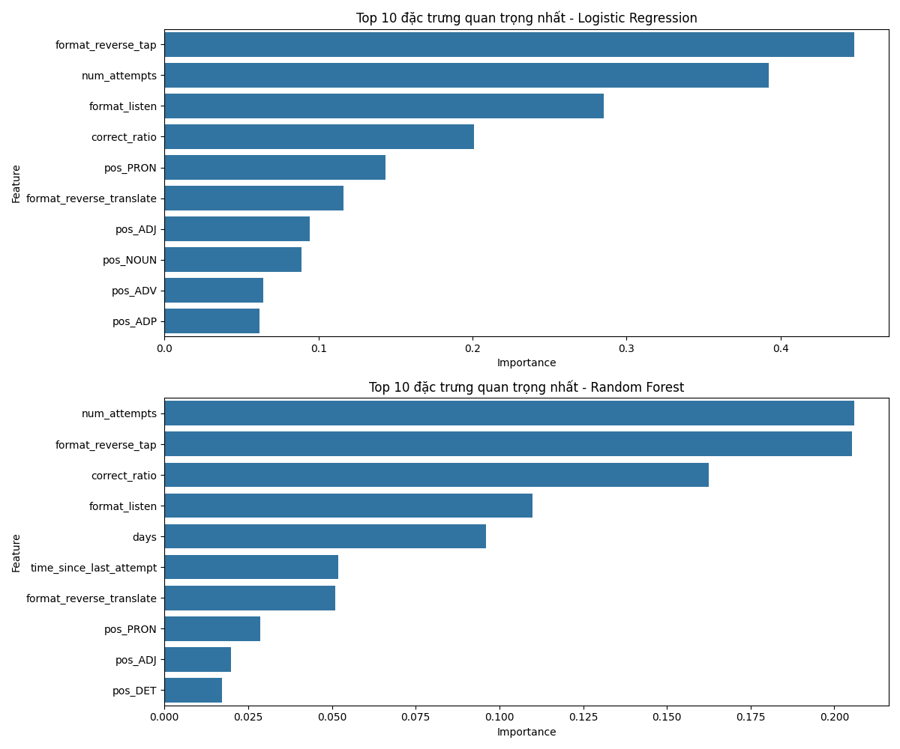

# Chương 6: Ứng dụng thực tế và đề xuất cải tiến trong tương lai

## 6.1. Ứng dụng thực tế của mô hình dự đoán khả năng ghi nhớ từ vựng

Dựa trên kết quả của mô hình Random Forest và Logistic Regression với độ chính xác khoảng 85.8%, tôi đề xuất các ứng dụng thực tế sau đây:

_Hình 6.1: Tầm quan trọng của các đặc trưng trong việc dự đoán khả năng ghi nhớ từ vựng_

### 6.1.1. Cá nhân hóa lịch trình ôn tập

Mô hình có thể được tích hợp vào các ứng dụng học ngôn ngữ để cá nhân hóa lịch trình ôn tập của học viên:

-   **Tối ưu hóa khoảng thời gian ôn tập**: Dựa trên dự đoán xác suất quên của từng từ vựng, hệ thống có thể điều chỉnh khoảng thời gian giữa các lần ôn tập để tối đa hóa hiệu quả ghi nhớ.

-   **Ưu tiên từ vựng có nguy cơ quên cao**: Hệ thống có thể sắp xếp lại thứ tự ôn tập, đưa các từ vựng có nguy cơ quên cao lên đầu danh sách, giúp học viên tập trung vào những từ vựng khó nhớ.

-   **Thông báo nhắc nhở thông minh**: Gửi thông báo nhắc nhở học viên ôn tập vào thời điểm tối ưu, dựa trên dự đoán của mô hình về thời điểm mà học viên có khả năng bắt đầu quên từ vựng.

### 6.1.2. Tối ưu hóa loại bài tập

Dựa trên kết quả phân tích tầm quan trọng của đặc trưng, tôi thấy rằng loại bài tập (đặc biệt là format_reverse_tap) có ảnh hưởng lớn đến khả năng ghi nhớ từ vựng. Vì vậy, hệ thống có thể:

-   **Điều chỉnh tỷ lệ các loại bài tập**: Tăng tỷ lệ bài tập dạng reverse_tap cho các từ vựng khó nhớ, giúp tăng cường khả năng ghi nhớ.

-   **Cá nhân hóa loại bài tập**: Dựa trên phân tích hiệu quả của từng loại bài tập đối với từng học viên, hệ thống có thể đề xuất loại bài tập phù hợp nhất cho mỗi học viên.

-   **Thiết kế bài tập mới**: Phát triển các loại bài tập mới dựa trên các đặc điểm của bài tập hiệu quả, nhằm tăng cường khả năng ghi nhớ từ vựng.

### 6.1.3. Phân tích tiến độ học tập

Mô hình có thể được sử dụng để phân tích tiến độ học tập của học viên và cung cấp phản hồi chi tiết:

-   **Báo cáo khả năng ghi nhớ**: Cung cấp báo cáo chi tiết về khả năng ghi nhớ từ vựng của học viên, bao gồm các từ vựng đã thuộc, đang học và có nguy cơ quên.

-   **Phân tích điểm mạnh và điểm yếu**: Xác định loại từ vựng mà học viên dễ hoặc khó ghi nhớ, giúp họ tập trung vào các điểm yếu.

-   **Dự đoán thời gian hoàn thành**: Dựa trên tốc độ học và khả năng ghi nhớ hiện tại, hệ thống có thể dự đoán thời gian cần thiết để học viên đạt được mục tiêu học tập.

## 6.2. Đề xuất cải tiến trong tương lai

Dựa trên kết quả nghiên cứu và các hạn chế của mô hình hiện tại, tôi đề xuất các hướng cải tiến sau đây:

### 6.2.1. Cải tiến về dữ liệu

-   **Thu thập dữ liệu dài hạn**: Mở rộng nghiên cứu với dữ liệu học tập dài hạn (6 tháng hoặc 1 năm) để phân tích sự thay đổi khả năng ghi nhớ từ vựng theo thời gian và xây dựng các mô hình dự đoán chính xác hơn.

-   **Đa dạng hóa nguồn dữ liệu**: Kết hợp dữ liệu từ nhiều nền tảng học ngôn ngữ khác nhau để tăng tính tổng quát của mô hình và khám phá các yếu tố ảnh hưởng đến khả năng ghi nhớ trong các ngữ cảnh học tập khác nhau.

-   **Thu thập dữ liệu về đặc điểm học viên**: Bổ sung thông tin về đặc điểm cá nhân của học viên (tuổi, trình độ học vấn, kinh nghiệm học ngôn ngữ) để phân tích ảnh hưởng của các yếu tố này đến khả năng ghi nhớ từ vựng.

### 6.2.2. Cải tiến về mô hình

-   **Sử dụng kỹ thuật học sâu**: Áp dụng các mô hình học sâu như Recurrent Neural Networks (RNN), Long Short-Term Memory (LSTM) hoặc Transformer để phân tích chuỗi dữ liệu hành vi theo thời gian và nắm bắt các mối quan hệ phức tạp giữa các đặc trưng.

-   **Mô hình đa nhiệm vụ**: Phát triển mô hình học đa nhiệm vụ để dự đoán đồng thời nhiều khía cạnh của quá trình học tập ngôn ngữ, như khả năng ghi nhớ từ vựng, thời gian học tập tối ưu và loại bài tập phù hợp.

-   **Học tăng cường**: Áp dụng các kỹ thuật học tăng cường để tối ưu hóa lịch trình ôn tập dựa trên phản hồi của học viên và cải thiện hiệu quả học tập theo thời gian.

### 6.2.3. Cải tiến về đặc trưng

-   **Phân tích ngữ nghĩa**: Bổ sung các đặc trưng về ngữ nghĩa của từ vựng, như mức độ trừu tượng, tần suất xuất hiện trong ngôn ngữ, và mối liên hệ với các từ vựng khác.

-   **Đặc trưng ngữ cảnh**: Khai thác thông tin về ngữ cảnh sử dụng từ vựng để đánh giá ảnh hưởng của ngữ cảnh đến khả năng ghi nhớ.

-   **Đặc trưng đa phương tiện**: Phân tích ảnh hưởng của các yếu tố đa phương tiện (hình ảnh, âm thanh) đến khả năng ghi nhớ từ vựng.

## 6.3. Đề xuất áp dụng mô hình vào hệ thống LMS riêng

Các mô hình dự đoán khả năng ghi nhớ từ vựng có thể được tích hợp vào hệ thống Quản lý học tập (LMS) riêng với các yêu cầu và đề xuất sau:

### 6.3.1. Yêu cầu kỹ thuật

-   **API tích hợp**: Phát triển API cho phép hệ thống LMS gửi dữ liệu học tập (lịch sử tương tác) và nhận về dự đoán về khả năng ghi nhớ từ vựng.

-   **Mô-đun theo dõi hành vi**: Bổ sung mô-đun thu thập dữ liệu về tương tác của học viên với từ vựng, bao gồm thời gian học, kết quả bài tập, và khoảng thời gian giữa các lần ôn tập.

-   **Cơ sở dữ liệu lưu trữ**: Thiết kế cơ sở dữ liệu phù hợp để lưu trữ thông tin về hành vi học tập và kết quả dự đoán.

### 6.3.2. Đề xuất triển khai

-   **Tích hợp từng phần**: Triển khai mô hình theo các giai đoạn, bắt đầu với tính năng cơ bản như dự đoán từ vựng cần ôn tập, sau đó mở rộng đến các tính năng nâng cao.

-   **Hệ thống phản hồi liên tục**: Thiết lập cơ chế thu thập phản hồi từ người dùng để đánh giá hiệu quả của các dự đoán và điều chỉnh mô hình theo thời gian.

-   **Tùy chỉnh theo ngữ cảnh**: Điều chỉnh mô hình để phù hợp với đặc điểm cụ thể của hệ thống LMS và đối tượng học viên.

## 6.4. Xây dựng hướng phát triển dịch vụ tư vấn

Dựa trên kết quả nghiên cứu, có thể phát triển các dịch vụ tư vấn chuyên nghiệp cho các tổ chức giáo dục và công ty phát triển ứng dụng học ngôn ngữ:

### 6.4.1. Dịch vụ tư vấn thiết kế hệ thống học tập

-   **Đánh giá và tối ưu hóa hệ thống hiện có**: Phân tích hệ thống học tập hiện tại, xác định điểm mạnh và điểm yếu, đề xuất cải tiến dựa trên mô hình dự đoán.

-   **Thiết kế thuật toán lên lịch ôn tập**: Phát triển thuật toán tùy chỉnh để tối ưu hóa lịch trình ôn tập từ vựng cho từng hệ thống cụ thể.

-   **Thiết kế bài tập hiệu quả**: Tư vấn về loại bài tập và cách thức trình bày nội dung để tối đa hóa khả năng ghi nhớ từ vựng.

### 6.4.2. Dịch vụ phân tích dữ liệu học tập

-   **Báo cáo phân tích**: Cung cấp dịch vụ phân tích dữ liệu học tập để xác định xu hướng, điểm yếu, và cơ hội cải thiện trong hệ thống học tập.

-   **Mô hình dự đoán tùy chỉnh**: Xây dựng và đào tạo các mô hình dự đoán tùy chỉnh dựa trên dữ liệu cụ thể của từng tổ chức.

-   **Đánh giá hiệu quả**: Thiết lập các phương pháp đánh giá hiệu quả của hệ thống học tập và theo dõi cải thiện theo thời gian.

### 6.4.3. Đào tạo và hỗ trợ kỹ thuật

-   **Đào tạo đội ngũ phát triển**: Cung cấp khóa đào tạo cho đội ngũ phát triển về cách tích hợp và tận dụng mô hình dự đoán trong hệ thống học tập.

-   **Hỗ trợ triển khai**: Hỗ trợ kỹ thuật trong quá trình triển khai mô hình và các thuật toán liên quan.

-   **Cập nhật liên tục**: Cung cấp dịch vụ cập nhật mô hình theo các nghiên cứu và kỹ thuật mới nhất trong lĩnh vực học máy và giáo dục ngôn ngữ.

## 6.5. Kết luận

Nghiên cứu này đã xây dựng và đánh giá các mô hình học máy để dự đoán khả năng ghi nhớ từ vựng tiếng Anh dựa trên dữ liệu hành vi học tập từ Duolingo. Kết quả cho thấy cả hai mô hình Logistic Regression và Random Forest đều đạt độ chính xác tương đương nhau, khoảng 85.8%, với các đặc trưng quan trọng bao gồm loại bài tập, số lần thử và tỷ lệ trả lời đúng.

Mặc dù có một số hạn chế, như độ nhạy thấp và dữ liệu chỉ bao gồm 30 ngày đầu tiên sử dụng ứng dụng, nhưng kết quả nghiên cứu vẫn có giá trị thực tiễn đáng kể. Các mô hình dự đoán có thể được tích hợp vào các ứng dụng học ngôn ngữ để cá nhân hóa lịch trình ôn tập, tối ưu hóa loại bài tập và phân tích tiến độ học tập của học viên.

Toàn bộ mã nguồn của nghiên cứu này được công khai, cho phép các nhà nghiên cứu, giáo viên và nhà phát triển giáo dục ứng dụng kiểm tra, sử dụng lại, và mở rộng các mô hình và phương pháp được trình bày trong tiểu luận này.

Trong tương lai, nghiên cứu có thể được mở rộng theo nhiều hướng, bao gồm thu thập dữ liệu dài hạn, áp dụng các kỹ thuật học sâu và bổ sung các đặc trưng mới để cải thiện hiệu suất dự đoán và tăng cường hiểu biết về quá trình học tập ngôn ngữ. Những cải tiến này sẽ góp phần phát triển các công cụ học tập ngôn ngữ hiệu quả hơn, giúp người học cải thiện khả năng ghi nhớ từ vựng và đạt được các mục tiêu học tập nhanh chóng hơn.
